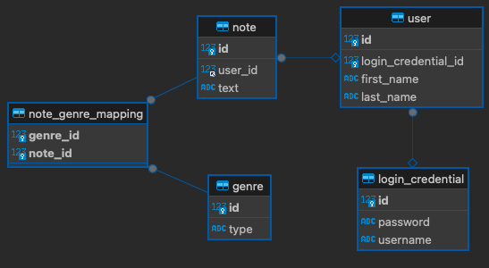

# demo-springboot-rest-hibernate-mysql

- This is a simple project to demo creating REST APIs using springboot, hibernate, and mysql.
- Features:
    - Exposes relevant APIs for resources `User` and `Note`.
    - All requests are validated before processing. If validation fails, an error response is returned with proper error
      code.
    - All 3 entity-relationships (one-to-one, one-to-many, many-to-many) are covered.
- Limitations:
    - Access-validation is not implemented; anyone can access any API.
    - Passwords are saved as plain-text (not encrypted/hashed).

# Tech-stack:

- java 17
- spring boot 3.4.0
- hibernate
- mysql
- lombok

# APIs:

```
- GET    : /users
- GET    : /users/{id}
- GET    : /users/{id}/notes
- POST   : /users
- PUT    : /users/{id}
- DELETE : /users/{id}

- GET    : /notes
- GET    : /notes/{id}
- POST   : /notes 
- PUT    : /notes/{id}
- DELETE : /notes/{id} 
```

# Database Model



# Entity-Relationship Model

```
login_credential <---one-to-one ---> user <--- one-to-many ---> note <--- many-to-many ---> genre                                                 
```

# Getting Started:

1. Make sure mysql server is up and running on port 3306
2. Create an "empty" database `demo-springboot-rest-hibernate-mysql`
3. Run the project

# Known Bugs:


